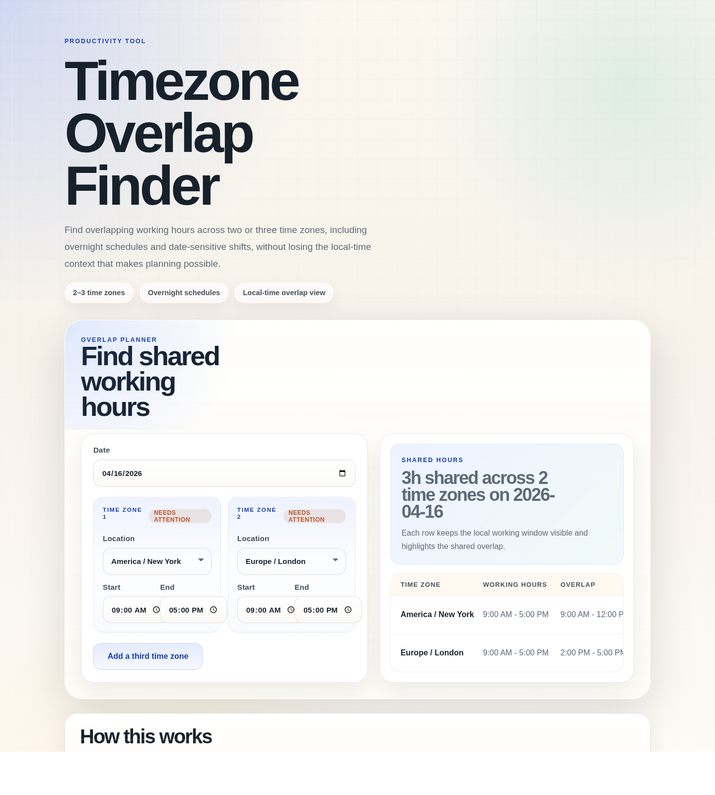

# Timezone Overlap Finder

A showcase-style overlap finder for comparing shared working hours across global teams, with multilingual UI support and preserved local-time context for every participant.

## Features

- Compare schedules across 2 or 3 IANA time zones
- Handle overnight shifts that wrap past midnight
- Switch the interface across 8 supported languages, including Arabic RTL
- Show overlap windows in each participant's local time
- Stay readable across desktop and mobile layouts

## Demo

  Live demo: https://FelixWardUS.github.io/timezone-overlap-finder/

## Screenshot



## Getting Started

Run a local static server from the project root:

```bash
python -m http.server 8000
```

Then open `http://localhost:8000`.

## Usage

1. Use the top-right language switcher if you want to view the interface in another language.
2. Choose the planning date.
3. Select two time zones and enter local start and end times.
4. Add the optional third zone when you need a broader overlap check.
5. Review the shared window summary and the local-time day view bars for each zone.
6. Adjust the date or schedules to account for DST-driven date shifts and overnight coverage.

## Roadmap

- Preset common team configurations for faster comparisons
- Shareable URLs that capture the active schedule state
- Export-friendly summaries for handoff into calendars or project docs

## License

MIT
